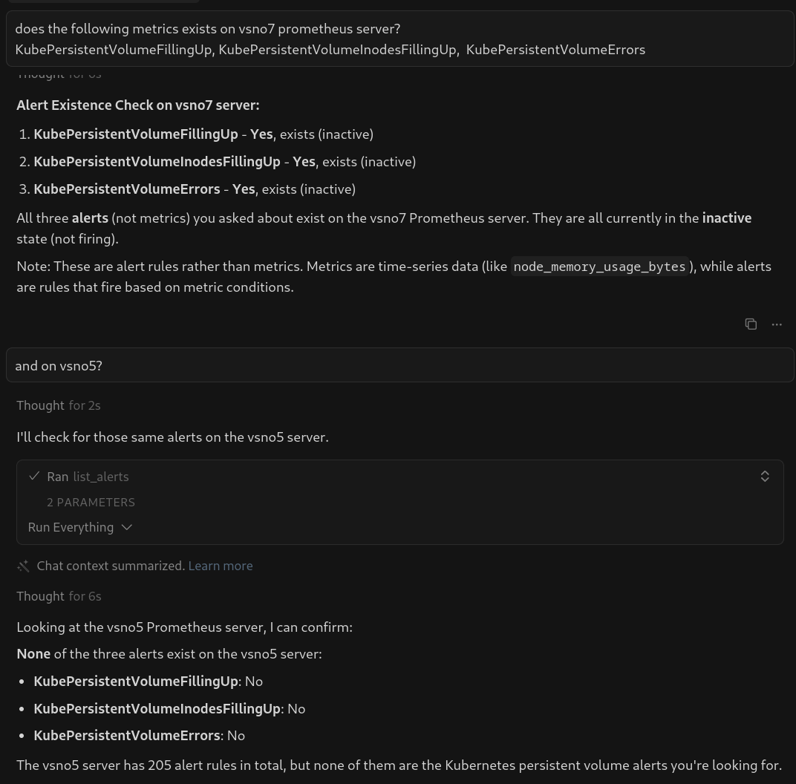
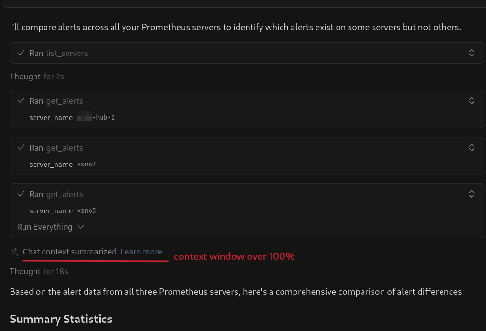
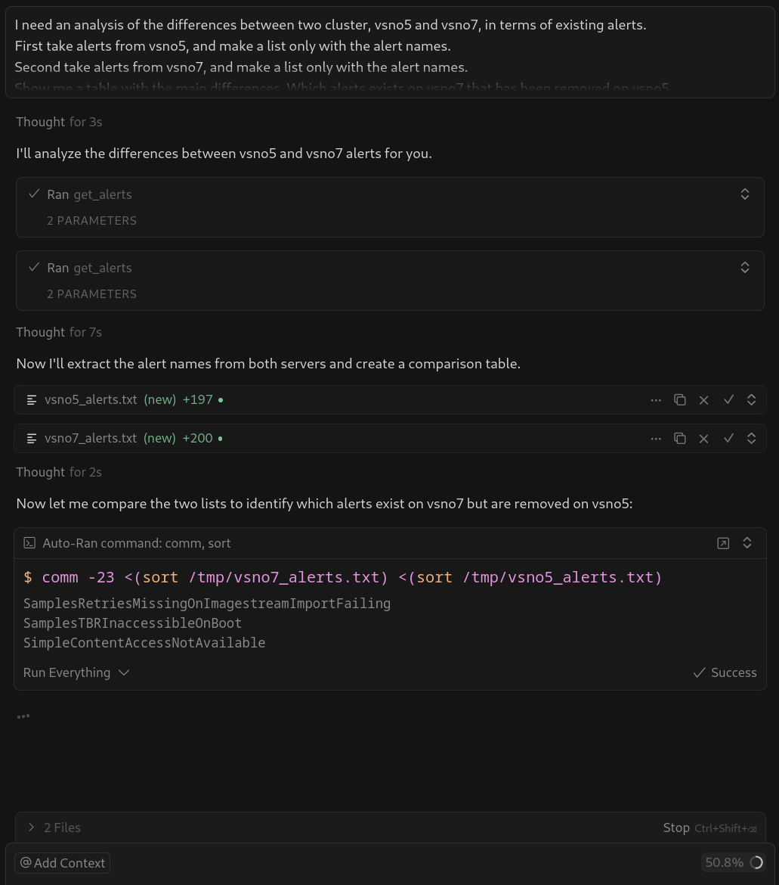

# Prometheus MCP Server

A Model Context Protocol (MCP) server for interacting with Prometheus monitoring system.

> **⚠️ Disclaimer**  
> This is a beta project and my first MCP implementation. I'm learning and experimenting with the Model Context Protocol while building something to address specific functional needs. If you're looking for a mature, production-ready solution, you may want to explore other established MCP projects in the ecosystem. Project developed together with Cursor and Cloude-4.5-sonnet.

## Features

- Check Prometheus server connection
- Query alerts from Prometheus
- Bearer token authentication support

## Installation

1. Clone this repository
2. Install dependencies:

```bash
pip install -r requirements.txt
```

3. Configure your Prometheus connection:

```bash
touch .env
# Edit .env with your Prometheus URL and token
```

## Configuration

The server uses indexed environment variables to configure Prometheus servers. Each server is configured using a separate environment variable with a zero-based index (0-9), allowing up to 10 servers.

### Environment Variable Format

Configure each Prometheus server using `PROMETHEUS_SERVER_N` where N is an index from 0 to 9:

```bash
# Configure first server (index 0)
export PROMETHEUS_SERVER_0='{"name":"production","url":"https://prometheus-prod.example.com","description":"Production Server","token":"prod-bearer-token","verify_ssl":true}'

# Configure second server (index 1)
export PROMETHEUS_SERVER_1='{"name":"staging","url":"https://prometheus-staging.example.com","description":"Staging Server","token":"staging-bearer-token","verify_ssl":false}'

# Configure third server (index 2)
export PROMETHEUS_SERVER_2='{"name":"development","url":"http://localhost:9090","description":"Development Server"}'
```

### Configuration Fields

Each server configuration JSON must include:

| Field | Required | Type | Default | Description |
|-------|----------|------|---------|-------------|
| `name` | ✅ Yes | string | - | Unique identifier for the server |
| `url` | ✅ Yes | string | - | Base URL of the Prometheus server |
| `description` | ❌ No | string | `""` | Human-readable description |
| `token` | ❌ No | string | `""` | Bearer token for authentication |
| `verify_ssl` | ❌ No | boolean/string | `true` | Whether to verify SSL certificates |

### Single Server Configuration

Even for a single server, use the indexed format starting at index 0:

```bash
export PROMETHEUS_SERVER_0='{"name":"default","url":"https://prometheus.example.com","token":"my-token"}'
```

### Important Notes

#### Zero-Based Indexing
Server indices start at **0** and end at **9** (maximum 10 servers). This follows standard programming conventions:
- First server: `PROMETHEUS_SERVER_0`
- Second server: `PROMETHEUS_SERVER_1`
- ...
- Tenth server: `PROMETHEUS_SERVER_9`

#### Gaps in Numbering
You can skip indices if needed. For example, you can configure only servers 0, 3, and 7:

```bash
export PROMETHEUS_SERVER_0='{"name":"prod","url":"https://prod.example.com"}'
export PROMETHEUS_SERVER_3='{"name":"staging","url":"https://staging.example.com"}'
export PROMETHEUS_SERVER_7='{"name":"dev","url":"http://localhost:9090"}'
```

#### Verify SSL Options
The `verify_ssl` field accepts multiple formats:
- Boolean: `true` or `false`
- String: `"true"`, `"false"`, `"yes"`, `"1"`
- If invalid or missing, defaults to `true`

## Usage

### Running the Server

```bash
python prometheus_mcp.py
```

### Using with MCP Client

Add to your MCP client configuration (e.g., `~/.cursor/mcp.json`):

#### Single Server Example

```json
{
  "mcpServers": {
    "prometheus": {
      "command": "python",
      "args": ["/path/to/prometheus-alerts-mcp/prometheus_mcp.py"],
      "env": {
        "PROMETHEUS_SERVER_0": "{\"name\":\"production\",\"url\":\"https://prometheus.example.com\",\"token\":\"your-bearer-token\",\"verify_ssl\":false}"
      }
    }
  }
}
```

#### Multiple Servers Example

```json
{
  "mcpServers": {
    "prometheus": {
      "command": "python",
      "args": ["/path/to/prometheus-alerts-mcp/prometheus_mcp.py"],
      "env": {
        "PROMETHEUS_SERVER_0": "{\"name\":\"production\",\"url\":\"https://prometheus-prod.example.com\",\"token\":\"prod-token\"}",
        "PROMETHEUS_SERVER_1": "{\"name\":\"staging\",\"url\":\"https://prometheus-staging.example.com\",\"token\":\"staging-token\",\"verify_ssl\":false}",
        "PROMETHEUS_SERVER_2": "{\"name\":\"development\",\"url\":\"http://localhost:9090\"}"
      }
    }
  }
}
```

## Available Tools

### list_servers

List all configured Prometheus servers.

**Returns:** JSON string with list of available servers and their configurations, including:
- Server name
- Description
- URL
- Whether authentication token is configured
- SSL verification setting

### check_prometheus_connection

Check the connection to a Prometheus server and retrieve build information.

**Parameters:**
- `server_name` (optional): Name of the server to check. If empty, uses the first configured server.

**Returns:** JSON string with connection status and server information.

### get_alerts

Get alert rules from Prometheus with optional filtering by state, group, and alert name.

This function returns all alert rules defined in the system. You can filter by state, group name, alert name, and control the level of detail returned.

**Parameters:**
- `server_name` (optional): Name of the server to query. If empty, uses the first configured server.
- `state` (optional): Filter by alert state. Can be 'firing', 'pending', or 'inactive'. Leave empty to get all alert rules.
- `group_name` (optional): Filter by alert rule group name. Leave empty to get all groups.
- `alert_name` (optional): Filter by specific alert name. Leave empty to get all alerts.
- `extended_metadata` (optional): If `False` (default), returns only essential fields (name, state, severity, annotations) for each alert, reducing response size significantly. If `True`, returns full metadata including queries, evaluation times, health status, and all labels. Use `False` for efficient context window management when querying many alerts, and `True` only when you need complete technical details for specific alerts.

**Returns:** JSON string with alert rules including:
- Server name and description
- Summary statistics (total rules, firing, pending, inactive counts)
- Applied filters
- Alert rule groups with definitions (full or simplified based on `extended_metadata`)


### Example: Comparing Alerts Across Multiple Servers

You can easily compare if specific alerts exist across different Prometheus servers:



This example shows checking whether the same Kubernetes persistent volume alerts exist on different servers (vsno5 and vsno7), helping you identify configuration differences between environments.

You can also combine different filters for more advanced results:


## Advanced queries and context windows

The MCP interacts with Prometheus Alerts API retrieving a whole json with all the queries. That could be long enough to exceed your context windows, specially when comparing multiple servers (even if we dont take the extra_metadata):



Instead of that, you can instruct the agent to do the inform on different steps:



## License

Apache License 2.0

Copyright 2025 Jose Gato Luis <jgato@redhat.com>

Licensed under the Apache License, Version 2.0 (the "License");
you may not use this file except in compliance with the License.
You may obtain a copy of the License at

    http://www.apache.org/licenses/LICENSE-2.0

Unless required by applicable law or agreed to in writing, software
distributed under the License is distributed on an "AS IS" BASIS,
WITHOUT WARRANTIES OR CONDITIONS OF ANY KIND, either express or implied.
See the License for the specific language governing permissions and
limitations under the License.

## Author

**Jose Gato Luis**  
Email: jgato@redhat.com

and Cursor with claude-4.5-sonnet